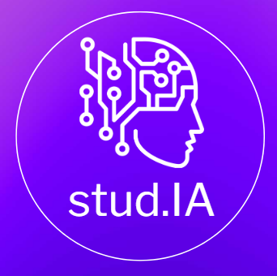

# Stud.IA - studiare non deve essere una pena

Ti offriamo:
- un assistente di studio personalizzato
- la gamification applicata al mondo della scuola
- il rimedio contro stress e ansia da studio

Tutto in un singolo prodotto software-as-a-service

Cosa aspetti?
[Prova la demo](https://www.nicolavision.com/stud-ia/)

La demo consiste in un sistema di IA che conosce il contenuto dei seguenti libri:
- Crossing the Chasm, Geoffrey A. Moore
- Inside the Tornado, Geoffrey A. Moore
- The Innovators Dilemma, Clayton M. Christensen

Puoi provare un quiz su crossing the chasm o farti spiegare gli argomenti che non hai capito dei tre libri. Puoi chiedere la generazione di altri quiz, che però ti verrano riportati in formato testuale sotto il prompt.
